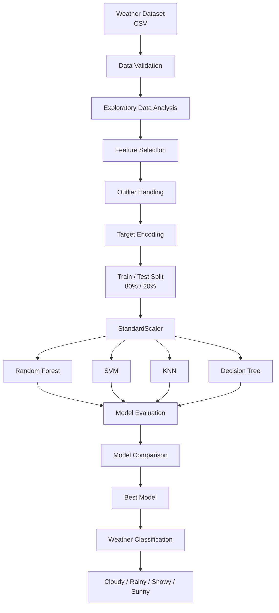

<div align="center">

# 🌦️ Weather Classification using Machine Learning

[](https://github.com/yashasalmol/weather-classification-ml/actions)
[](https://codecov.io/gh/yashasalmol/weather-classification-ml)
[](https://www.python.org/)
[](https://scikit-learn.org/)
[](LICENSE)

### Classify weather conditions accurately from atmospheric measurements using reproducible Scikit-learn models.

Machine-learning classification of **Sunny, Rainy, Cloudy, and Snowy** weather conditions using meteorological observations and multiple supervised-learning algorithms.

</div>

---

## 🎬 Demo

<div align="center">


**Demo:** Atmospheric measurements are passed through preprocessing and a trained classifier to predict the corresponding weather condition.

</div>

> **Note:** Add your demo GIF as `assets/weather-classification-demo.gif`.
> A confusion matrix, prediction demo, or short screen recording of notebook inference works well.

---

## 📑 Table of Contents

* [Overview](#-overview)
* [Key Features](#-key-features)
* [Dataset](#-dataset)
* [Technology Stack](#-technology-stack)
* [Installation](#-installation)
* [Quick Start](#-quick-start)
* [Project Architecture](#-project-architecture)
* [Machine Learning Pipeline](#-machine-learning-pipeline)
* [Model Performance](#-model-performance)
* [Training from Scratch](#-training-from-scratch)
* [Configuration](#-configuration)
* [API Reference](#-api-reference)
* [Project Structure](#-project-structure)
* [Reproducibility](#-reproducibility)
* [Limitations](#-limitations)
* [Future Improvements](#-future-improvements)
* [Contributing](#-contributing)
* [Citation](#-citation)
* [License](#-license)

---

## 🔎 Overview

Weather classification is a multiclass supervised-learning problem in which meteorological measurements are used to determine the most likely weather condition.

This project analyzes a structured weather dataset and evaluates several classical machine-learning algorithms for predicting four weather classes:

* ☁️ **Cloudy**
* 🌧️ **Rainy**
* ❄️ **Snowy**
* ☀️ **Sunny**

The workflow covers:

1. Data loading
2. Data-quality inspection
3. Exploratory data analysis
4. Feature selection
5. Target encoding
6. Outlier handling
7. Train/test splitting
8. Feature scaling
9. Model training
10. Model comparison
11. Weather classification

The current experiment shows **Random Forest** as the best-performing evaluated model, reaching approximately **93.14% test accuracy**.

---

## ✨ Key Features

* 📊 Analysis of **13,200 weather observations**
* 🎯 Four balanced target classes in the original dataset
* 🧹 Missing-value and outlier analysis
* 📈 Exploratory data analysis with Matplotlib and Seaborn
* ⚙️ Feature standardization using `StandardScaler`
* 🏷️ Target encoding using `LabelEncoder`
* 🌲 Random Forest classification
* 📐 Support Vector Machine classification
* 🧭 K-Nearest Neighbors classification
* 🌳 Decision Tree classification
* 🧪 Reproducible 80/20 train/test evaluation
* 📓 Fully documented Jupyter Notebook workflow
* 🏆 Model comparison based on held-out test accuracy

---

## 📊 Dataset

The project uses:

```text
data/weather_classification_data.csv
```

### Dataset Size

| Property                   |          Value |
| -------------------------- | -------------: |
| Total observations         |         13,200 |
| Original columns           |             11 |
| Target classes             |              4 |
| Missing values             |              0 |
| Original samples per class |          3,300 |
| Target                     | `Weather Type` |

### Target Classes

```text
Cloudy
Rainy
Snowy
Sunny
```

The original dataset is evenly distributed across the four target categories.

### Original Features

| Feature                | Description              | Type        |
| ---------------------- | ------------------------ | ----------- |
| `Temperature`          | Recorded temperature     | Numerical   |
| `Humidity`             | Relative humidity        | Numerical   |
| `Wind Speed`           | Wind velocity            | Numerical   |
| `Precipitation (%)`    | Precipitation percentage | Numerical   |
| `Cloud Cover`          | Cloud condition          | Categorical |
| `Atmospheric Pressure` | Atmospheric pressure     | Numerical   |
| `UV Index`             | Ultraviolet index        | Numerical   |
| `Season`               | Season category          | Categorical |
| `Visibility (km)`      | Visibility distance      | Numerical   |
| `Location`             | Geographic type          | Categorical |
| `Weather Type`         | Classification target    | Categorical |

### Features Used by the Current Models

The current notebook removes:

```text
Cloud Cover
Season
Location
```

The resulting predictors are:

```text
Temperature
Humidity
Wind Speed
Precipitation (%)
Atmospheric Pressure
UV Index
Visibility (km)
```

<details>
<summary><strong>Why are some categorical features excluded?</strong></summary>

The current implementation focuses on a numerical feature set and removes three categorical attributes before training.

A future version should benchmark this approach against proper categorical encoding using techniques such as:

* One-hot encoding
* Ordinal encoding where appropriate
* `ColumnTransformer`
* Complete Scikit-learn preprocessing pipelines

This would determine whether the excluded categorical variables provide additional predictive value.

</details>

---

## 🧰 Technology Stack

### Core

* **Python**
* **NumPy**
* **Pandas**
* **Scikit-learn**

### Visualization

* **Matplotlib**
* **Seaborn**

### Development

* **Jupyter Notebook**
* **Git**
* **GitHub**

### Machine Learning

* `RandomForestClassifier`
* `SVC`
* `KNeighborsClassifier`
* `DecisionTreeClassifier`
* `StandardScaler`
* `LabelEncoder`
* `train_test_split`

---

## 📦 Installation

### Requirements

Recommended reproducible environment:

```text
Python == 3.11.x
```

### Clone the Repository

```bash
git clone https://github.com/yashasalmol/weather-classification-ml.git
cd weather-classification-ml
```

---

### Option 1 — pip

Create a virtual environment:

#### Windows

```bash
python -m venv .venv
.venv\Scripts\activate
```

#### Linux / macOS

```bash
python3 -m venv .venv
source .venv/bin/activate
```

Upgrade pip:

```bash
python -m pip install --upgrade pip
```

Install pinned dependencies:

```bash
pip install \
numpy==2.0.2 \
pandas==2.2.3 \
scikit-learn==1.7.0 \
matplotlib==3.9.2 \
seaborn==0.13.2 \
jupyter==1.1.1 \
joblib==1.4.2
```

Or, after adding a `requirements.txt` file:

```bash
pip install -r requirements.txt
```

Recommended `requirements.txt`:

```text
numpy==2.0.2
pandas==2.2.3
scikit-learn==1.7.0
matplotlib==3.9.2
seaborn==0.13.2
jupyter==1.1.1
joblib==1.4.2
```

---

### Option 2 — Conda

```bash
conda create -n weather-classification python=3.11 -y
conda activate weather-classification
```

Install dependencies:

```bash
conda install -y \
numpy=2.0 \
pandas=2.2 \
scikit-learn=1.7 \
matplotlib=3.9 \
seaborn=0.13 \
jupyter
```

Verify the environment:

```bash
python --version
```

Expected:

```text
Python 3.11.x
```

Verify Scikit-learn:

```bash
python -c "import sklearn; print(sklearn.__version__)"
```

---

### CUDA / GPU Compatibility

> **CUDA is not required for this project.**

The current implementation uses classical Scikit-learn estimators. These models execute primarily on the **CPU** and do not use NVIDIA CUDA acceleration.

Therefore:

```text
CUDA:       Not required
cuDNN:      Not required
GPU:        Optional / not used
CPU:        Required
```

Using an NVIDIA T4, A10, A100, or similar GPU will not substantially accelerate the current Scikit-learn implementation.

For GPU-accelerated experimentation, a future implementation could investigate:

* RAPIDS cuML
* XGBoost GPU training
* LightGBM GPU training
* PyTorch
* TensorFlow

---

## ⚡ Quick Start

You can verify the dataset and train a Random Forest model directly from the repository.

Run:

```bash
python
```

Then paste:

```python
import pandas as pd

from sklearn.ensemble import RandomForestClassifier
from sklearn.metrics import accuracy_score
from sklearn.model_selection import train_test_split
from sklearn.preprocessing import LabelEncoder, StandardScaler


# 1. Load data
df = pd.read_csv("data/weather_classification_data.csv")


# 2. Remove categorical features excluded by the current experiment
df = df.drop(
    columns=[
        "Cloud Cover",
        "Season",
        "Location",
    ]
)


# 3. Encode target labels
encoder = LabelEncoder()
df["Weather Type"] = encoder.fit_transform(df["Weather Type"])


# 4. Apply the current visibility IQR filter
q1 = df["Visibility (km)"].quantile(0.25)
q3 = df["Visibility (km)"].quantile(0.75)
iqr = q3 - q1

lower_bound = q1 - 1.5 * iqr
upper_bound = q3 + 1.5 * iqr

df = df[
    (df["Visibility (km)"] >= lower_bound)
    & (df["Visibility (km)"] <= upper_bound)
]


# 5. Separate features and target
X = df.drop(columns=["Weather Type"])
y = df["Weather Type"]


# 6. Train/test split
X_train, X_test, y_train, y_test = train_test_split(
    X,
    y,
    test_size=0.20,
    random_state=42,
)


# 7. Standardize features
scaler = StandardScaler()

X_train = scaler.fit_transform(X_train)
X_test = scaler.transform(X_test)


# 8. Train Random Forest
model = RandomForestClassifier(
    n_estimators=200,
    random_state=42,
)

model.fit(X_train, y_train)


# 9. Evaluate
predictions = model.predict(X_test)

accuracy = accuracy_score(y_test, predictions)

print(f"Test accuracy: {accuracy:.4f}")
print("Classes:", list(encoder.classes_))
```

Expected output should be approximately:

```text
Test accuracy: ~0.92–0.94
Classes: ['Cloudy', 'Rainy', 'Snowy', 'Sunny']
```

> Minor differences can occur when model randomization, package versions, or preprocessing implementation changes.

---

## 🏗 Project Architecture



### Inference Flow

```text
Meteorological Input
        │
        ▼
┌───────────────────────┐
│ Feature Validation    │
└──────────┬────────────┘
           │
           ▼
┌───────────────────────┐
│ Feature Preprocessing │
│ + StandardScaler      │
└──────────┬────────────┘
           │
           ▼
┌───────────────────────┐
│ Trained Classifier    │
└──────────┬────────────┘
           │
           ▼
┌───────────────────────┐
│ Encoded Prediction    │
└──────────┬────────────┘
           │
           ▼
┌───────────────────────┐
│ Decode Weather Class  │
└──────────┬────────────┘
           │
           ▼
   Weather Condition
```

---

## 🔬 Machine Learning Pipeline

### 1. Data Validation

The dataset is inspected for:

* Dataset dimensions
* Data types
* Missing values
* Target distribution
* Descriptive statistics
* Potential outliers

The source dataset contains **no missing values**.

---

### 2. Feature Selection

The current experiment removes categorical variables:

```python
data = data.drop(
    ["Cloud Cover", "Season", "Location"],
    axis=1,
)
```

---

### 3. Label Encoding

The target variable is converted into numerical labels:

```python
from sklearn.preprocessing import LabelEncoder

encoder = LabelEncoder()

data["Weather Type"] = encoder.fit_transform(
    data["Weather Type"]
)
```

---

### 4. Outlier Handling

The current notebook applies the IQR method to `Visibility (km)`.

```python
Q1 = data["Visibility (km)"].quantile(0.25)
Q3 = data["Visibility (km)"].quantile(0.75)

IQR = Q3 - Q1

lower_bound = Q1 - 1.5 * IQR
upper_bound = Q3 + 1.5 * IQR

data = data[
    (data["Visibility (km)"] >= lower_bound)
    & (data["Visibility (km)"] <= upper_bound)
]
```

---

### 5. Train/Test Split

```python
X_train, X_test, y_train, y_test = train_test_split(
    X,
    y,
    test_size=0.20,
    random_state=42,
)
```

This provides:

```text
Training data: 80%
Testing data:  20%
```

---

### 6. Feature Standardization

```python
scaler = StandardScaler()

X_train = scaler.fit_transform(X_train)
X_test = scaler.transform(X_test)
```

The scaler is fitted **only on the training data**, helping prevent test-set information from influencing scaling parameters.

---

### 7. Model Training

Four classifiers are evaluated:

```text
Random Forest
Support Vector Machine
K-Nearest Neighbors
Decision Tree
```

---

## 📈 Model Performance

### Held-Out Test Results

The following results come from the current notebook's 20% held-out test set.

| Rank | Model                   | Configuration                    | Test Accuracy |
| ---: | ----------------------- | -------------------------------- | ------------: |
| 🥇 1 | **Random Forest**       | `n_estimators=200`               |    **93.14%** |
| 🥈 2 | **Decision Tree**       | Default configuration            |    **93.06%** |
| 🥉 3 | **SVM**                 | Default `SVC()`                  |    **92.94%** |
|    4 | **K-Nearest Neighbors** | Default `KNeighborsClassifier()` |    **92.00%** |

### Best Recorded Model

```text
Random Forest Classifier
n_estimators = 200
Recorded accuracy ≈ 93.14%
```

The performance gap between the three strongest classifiers is relatively small, so accuracy alone should not be interpreted as proof that Random Forest is universally superior.

Additional evaluation is recommended.

---

### Metric Definition

#### Accuracy

Accuracy measures the proportion of test samples classified correctly.

```text
                 Correct Predictions
Accuracy = --------------------------------
                 Total Predictions
```

Or:

[
Accuracy = \frac{TP + TN}{TP + TN + FP + FN}
]

For multiclass classification, accuracy represents the fraction of observations whose predicted class matches the actual class.

---

### Recommended Additional Metrics

A stronger evaluation should also report:

| Metric                 | Purpose                                              |
| ---------------------- | ---------------------------------------------------- |
| Precision              | How reliable positive predictions are                |
| Recall                 | How many actual examples of each class are recovered |
| F1 Score               | Balance between precision and recall                 |
| Macro F1               | Gives equal importance to each weather class         |
| Confusion Matrix       | Shows which weather categories are confused          |
| Cross-validation score | Measures stability across multiple splits            |

Example:

```python
from sklearn.metrics import classification_report

print(
    classification_report(
        y_test,
        predictions,
        target_names=encoder.classes_,
    )
)
```

---

## 🏋️ Training from Scratch

### Step 1 — Clone

```bash
git clone https://github.com/yashasalmol/weather-classification-ml.git
cd weather-classification-ml
```

### Step 2 — Create Environment

```bash
python -m venv .venv
```

Activate it and install dependencies.

### Step 3 — Verify Dataset

Confirm:

```text
data/weather_classification_data.csv
```

exists.

### Step 4 — Start Jupyter

```bash
jupyter notebook
```

Open:

```text
notebooks/weather_classification.ipynb
```

> When running the notebook from the `notebooks/` directory, use:

```python
pd.read_csv("../data/weather_classification_data.csv")
```

rather than expecting the CSV in the notebook directory.

### Step 5 — Execute Preprocessing

Run:

```text
Data loading
      ↓
Data-quality analysis
      ↓
Feature selection
      ↓
Label encoding
      ↓
Outlier handling
      ↓
Train/test split
      ↓
Standard scaling
```

### Step 6 — Train Models

The Random Forest experiment uses:

```python
RandomForestClassifier(
    n_estimators=200
)
```

The other evaluated classifiers use default Scikit-learn configurations:

```python
SVC()

KNeighborsClassifier()

DecisionTreeClassifier()
```

### Step 7 — Evaluate

```python
accuracy_score(
    y_test,
    y_pred,
)
```

### Step 8 — Compare

Select the best-performing model according to the chosen evaluation criteria.

---

## ⚙️ Configuration

For a more production-oriented repository, move experiment parameters into:

```text
configs/default.yaml
```

Recommended configuration:

```yaml
project:
  name: weather-classification
  random_state: 42

data:
  path: data/weather_classification_data.csv
  target: Weather Type

features:
  drop:
    - Cloud Cover
    - Season
    - Location

preprocessing:
  scaler: standard
  visibility_outlier_filter: true
  iqr_multiplier: 1.5

split:
  test_size: 0.20
  random_state: 42

model:
  name: random_forest
  n_estimators: 200
  random_state: 42
  n_jobs: -1

evaluation:
  metrics:
    - accuracy
    - precision_macro
    - recall_macro
    - f1_macro
```

<details>
<summary><strong>Hyperparameter Reference</strong></summary>

### `test_size`

```yaml
test_size: 0.20
```

Reserves 20% of the processed dataset for final evaluation.

### `random_state`

```yaml
random_state: 42
```

Controls repeatability for randomized operations.

### `n_estimators`

```yaml
n_estimators: 200
```

Defines how many decision trees are created by the Random Forest.

More trees can improve stability but increase computation and model size.

### `n_jobs`

```yaml
n_jobs: -1
```

Allows Random Forest to use all available CPU cores.

### `iqr_multiplier`

```yaml
iqr_multiplier: 1.5
```

Controls the IQR threshold used for visibility outlier filtering.

</details>

---

## ⏱ Training Time

This dataset is small by modern machine-learning standards.

The workload should generally complete in **seconds to under a minute** on modern CPU hardware, depending on machine specifications and library versions.

| Hardware                  | GPU Acceleration | Expected Scale          |
| ------------------------- | ---------------- | ----------------------- |
| Modern laptop CPU         | No               | Seconds                 |
| 8-core desktop CPU        | No               | Seconds                 |
| GitHub Actions CPU runner | No               | Seconds–under 1 minute  |
| NVIDIA T4                 | Not used         | No meaningful advantage |
| NVIDIA A10                | Not used         | No meaningful advantage |
| NVIDIA A100               | Not used         | No meaningful advantage |

> These are workload-scale expectations, not formal benchmark measurements. Record actual wall-clock timings before publishing precise training-time claims.

You can measure training time using:

```python
from time import perf_counter

start = perf_counter()

model.fit(X_train, y_train)

elapsed = perf_counter() - start

print(f"Training time: {elapsed:.3f} seconds")
```

---

## 🧩 API Reference

The current repository is notebook-first.

For production use, the notebook should be modularized into something similar to:

```text
src/
└── weather_classifier/
    ├── __init__.py
    ├── data.py
    ├── preprocessing.py
    ├── model.py
    └── inference.py
```

The following API is the recommended interface.

---

### `load_data()`

```python
def load_data(
    path: str,
) -> pandas.DataFrame:
```

Loads the weather classification dataset.

#### Parameters

| Parameter | Type  | Description                  |
| --------- | ----- | ---------------------------- |
| `path`    | `str` | Path to the weather CSV file |

#### Returns

```text
pandas.DataFrame
```

#### Example 1

```python
from weather_classifier.data import load_data

df = load_data(
    "data/weather_classification_data.csv"
)

print(df.shape)
```

Expected original shape:

```text
(13200, 11)
```

#### Example 2

```python
df = load_data(
    path="data/weather_classification_data.csv"
)

print(df["Weather Type"].value_counts())
```

---

### `preprocess_data()`

```python
def preprocess_data(
    dataframe: pandas.DataFrame,
    target: str = "Weather Type",
) -> tuple[
    pandas.DataFrame,
    pandas.Series,
    sklearn.preprocessing.LabelEncoder,
]:
```

Applies feature selection, target encoding, and configured data-cleaning operations.

#### Parameters

| Parameter   | Type           | Description         |
| ----------- | -------------- | ------------------- |
| `dataframe` | `pd.DataFrame` | Raw weather dataset |
| `target`    | `str`          | Target column       |

#### Returns

```text
X
y
label_encoder
```

#### Example 1

```python
from weather_classifier.preprocessing import preprocess_data

X, y, encoder = preprocess_data(df)

print(X.shape)
print(encoder.classes_)
```

#### Example 2

```python
X, y, encoder = preprocess_data(
    dataframe=df,
    target="Weather Type",
)

print(y.value_counts())
```

---

### `train_model()`

```python
def train_model(
    X_train: numpy.ndarray,
    y_train: numpy.ndarray,
    *,
    n_estimators: int = 200,
    random_state: int = 42,
) -> sklearn.ensemble.RandomForestClassifier:
```

Trains the Random Forest classifier.

#### Parameters

| Parameter      | Type         |  Default | Description          |
| -------------- | ------------ | -------: | -------------------- |
| `X_train`      | `np.ndarray` | Required | Training features    |
| `y_train`      | `np.ndarray` | Required | Training labels      |
| `n_estimators` | `int`        |    `200` | Number of trees      |
| `random_state` | `int`        |     `42` | Reproducibility seed |

#### Returns

```text
RandomForestClassifier
```

#### Example 1

```python
model = train_model(
    X_train,
    y_train,
)
```

#### Example 2

```python
model = train_model(
    X_train,
    y_train,
    n_estimators=300,
    random_state=42,
)
```

---

### `predict_weather()`

```python
def predict_weather(
    model,
    scaler,
    features: pandas.DataFrame,
    encoder,
) -> numpy.ndarray:
```

Predicts human-readable weather categories.

#### Parameters

| Parameter  | Description                    |
| ---------- | ------------------------------ |
| `model`    | Trained Scikit-learn estimator |
| `scaler`   | Fitted `StandardScaler`        |
| `features` | Input weather observations     |
| `encoder`  | Fitted target `LabelEncoder`   |

#### Returns

```text
numpy.ndarray
```

Containing weather labels such as:

```text
Sunny
Rainy
Cloudy
Snowy
```

#### Example 1 — Single Observation

```python
import pandas as pd

sample = pd.DataFrame(
    [{
        "Temperature": 30.0,
        "Humidity": 64,
        "Wind Speed": 7.0,
        "Precipitation (%)": 16.0,
        "Atmospheric Pressure": 1018.72,
        "UV Index": 5,
        "Visibility (km)": 5.5,
    }]
)

prediction = predict_weather(
    model,
    scaler,
    sample,
    encoder,
)

print(prediction)
```

#### Example 2 — Batch Prediction

```python
predictions = predict_weather(
    model=model,
    scaler=scaler,
    features=test_dataframe,
    encoder=encoder,
)

for weather in predictions[:5]:
    print(weather)
```

#### Example 3 — CSV Input

```python
samples = pd.read_csv(
    "data/unseen_weather.csv"
)

predictions = predict_weather(
    model,
    scaler,
    samples,
    encoder,
)
```

---

## 📁 Project Structure

### Current Repository

```text
weather-classification-ml/
│
├── data/
│   └── weather_classification_data.csv
│
├── notebooks/
│   └── weather_classification.ipynb
│
└── README.md
```

### Recommended Production Structure

```text
weather-classification-ml/
│
├── .github/
│   ├── ISSUE_TEMPLATE/
│   ├── workflows/
│   │   └── ci.yml
│   └── pull_request_template.md
│
├── assets/
│   ├── weather-classification-demo.gif
│   ├── confusion-matrix.png
│   └── model-comparison.png
│
├── configs/
│   └── default.yaml
│
├── data/
│   └── weather_classification_data.csv
│
├── notebooks/
│   └── weather_classification.ipynb
│
├── src/
│   └── weather_classifier/
│       ├── __init__.py
│       ├── data.py
│       ├── preprocessing.py
│       ├── model.py
│       └── inference.py
│
├── tests/
│   ├── test_data.py
│   ├── test_preprocessing.py
│   └── test_model.py
│
├── .flake8
├── .gitignore
├── .pre-commit-config.yaml
├── LICENSE
├── pyproject.toml
├── requirements.txt
└── README.md
```

---

## 🔁 Reproducibility

For reproducible experiments:

1. Pin dependency versions.
2. Use `random_state=42`.
3. Fit preprocessing only on training data where applicable.
4. Store preprocessing objects with the model.
5. Record dataset version/checksum.
6. Separate training and inference code.
7. Avoid manually modifying test data.
8. Preserve model configurations.

Recommended model serialization:

```python
import joblib

joblib.dump(
    {
        "model": model,
        "scaler": scaler,
        "encoder": encoder,
    },
    "artifacts/weather_classifier.joblib",
)
```

Load:

```python
artifacts = joblib.load(
    "artifacts/weather_classifier.joblib"
)

model = artifacts["model"]
scaler = artifacts["scaler"]
encoder = artifacts["encoder"]
```

---

## ⚠️ Limitations

The current project should be interpreted as an educational machine-learning classification experiment rather than an operational weather forecasting system.

Important limitations include:

* The model classifies weather categories; it does **not** perform temporal weather forecasting.
* Evaluation currently relies mainly on accuracy.
* The experiment uses a single train/test split.
* Three categorical features are excluded.
* Hyperparameter tuning is limited.
* No probability calibration analysis is currently reported.
* No cross-validation statistics are currently reported.
* No external dataset validation has been performed.
* No production inference API is currently deployed.
* Classical Scikit-learn algorithms are CPU-oriented.
* Real-world meteorological systems require significantly more complex spatial and temporal information.

---

## 🚀 Future Improvements

### Modeling

* [ ] Add stratified cross-validation
* [ ] Calculate precision, recall, and macro F1
* [ ] Add confusion matrices
* [ ] Perform hyperparameter optimization
* [ ] Evaluate Gradient Boosting
* [ ] Evaluate XGBoost / LightGBM
* [ ] Add feature importance analysis
* [ ] Add SHAP explainability
* [ ] Compare encoded categorical features against feature removal

### Engineering

* [ ] Convert notebook logic into reusable Python modules
* [ ] Build complete Scikit-learn `Pipeline`
* [ ] Add unit tests
* [ ] Add type hints
* [ ] Add structured configuration
* [ ] Serialize preprocessing and model artifacts
* [ ] Add CI with GitHub Actions
* [ ] Add Codecov coverage reporting
* [ ] Add pre-commit hooks

### Deployment

* [ ] Build a Streamlit demonstration
* [ ] Create a FastAPI prediction API
* [ ] Containerize using Docker
* [ ] Add batch prediction support
* [ ] Add model versioning

### Documentation

* [ ] Add prediction GIF
* [ ] Add confusion matrix
* [ ] Add model comparison chart
* [ ] Add feature importance visualization
* [ ] Document dataset provenance
* [ ] Add benchmark runtime measurements

---

## 🤝 Contributing

Contributions, improvements, bug reports, and feature suggestions are welcome.

### Development Workflow

Fork the repository:

```bash
git clone https://github.com/YOUR_USERNAME/weather-classification-ml.git
cd weather-classification-ml
```

Create a branch:

```bash
git checkout -b feature/add-cross-validation
```

Make your changes, run quality checks, and commit:

```bash
git add .
git commit -m "feat: add stratified cross-validation"
```

Push:

```bash
git push origin feature/add-cross-validation
```

Then open a Pull Request.

---

### Branch Naming

Use:

```text
feature/<description>
fix/<description>
docs/<description>
refactor/<description>
test/<description>
experiment/<description>
```

Examples:

```text
feature/add-cross-validation
feature/streamlit-demo
fix/data-path
docs/improve-installation
refactor/preprocessing-pipeline
test/model-evaluation
experiment/xgboost
```

---

### Commit Style

Recommended Conventional Commit format:

```text
feat: add Random Forest training pipeline
fix: correct dataset relative path
docs: document model evaluation metrics
test: add preprocessing unit tests
refactor: move feature processing into pipeline
chore: configure pre-commit hooks
```

Avoid vague commits such as:

```text
update
changes
final
test
again
new
```

---

### Code Style

Python code should follow:

* PEP 8
* Type hints where practical
* Clear docstrings
* Small reusable functions
* Descriptive variable names

Format with Black:

```bash
black .
```

Check with Flake8:

```bash
flake8 .
```

---

### Pre-commit

Install:

```bash
pip install pre-commit black flake8
```

Enable hooks:

```bash
pre-commit install
```

Run manually:

```bash
pre-commit run --all-files
```

Recommended `.pre-commit-config.yaml`:

```yaml
repos:
  - repo: https://github.com/psf/black
    rev: 24.10.0
    hooks:
      - id: black

  - repo: https://github.com/pycqa/flake8
    rev: 7.1.1
    hooks:
      - id: flake8

  - repo: https://github.com/pre-commit/pre-commit-hooks
    rev: v5.0.0
    hooks:
      - id: trailing-whitespace
      - id: end-of-file-fixer
      - id: check-yaml
      - id: check-added-large-files
```

---

### Pull Request Template

<details>
<summary><strong>PR Template</strong></summary>

```markdown
## Description

Briefly describe the change.

## Type of Change

- [ ] Bug fix
- [ ] New feature
- [ ] Model improvement
- [ ] Documentation
- [ ] Refactoring
- [ ] Testing

## Changes Made

-
-
-

## Validation

Describe how the change was tested.

## Model Impact

If applicable:

| Metric | Before | After |
|---|---:|---:|
| Accuracy | | |
| Macro F1 | | |

## Checklist

- [ ] Code runs successfully
- [ ] Tests pass
- [ ] Black formatting passes
- [ ] Flake8 passes
- [ ] Documentation has been updated
- [ ] No sensitive data is included
```

</details>

---

### Issue Reporting

<details>
<summary><strong>Bug Report Format</strong></summary>

````markdown
## Bug Description

Describe the problem clearly.

## Steps to Reproduce

1.
2.
3.

## Expected Behavior

Explain what should happen.

## Actual Behavior

Explain what actually happens.

## Environment

- OS:
- Python version:
- Scikit-learn version:
- Pandas version:

## Error

```text
Paste the complete error here.
````

## Additional Context

Add screenshots, logs, or relevant information.

````

</details>

---

## 📚 Citation

If this repository supports your project, report, coursework, or research, you can cite the software repository as:

```bibtex
@software{asalmol_weather_classification_2026,
  author       = {Yash Asalmol},
  title        = {Weather Classification using Machine Learning},
  year         = {2026},
  publisher    = {GitHub},
  url          = {https://github.com/yashasalmol/weather-classification-ml},
  note         = {Machine learning classification of weather conditions using Scikit-learn}
}
````

---

## 📄 License

Add a `LICENSE` file before presenting the project as licensed.

For an open-source portfolio project, the **MIT License** is a common permissive option.

Once the license file is added, GitHub and the license badge at the top of this README will detect it automatically.

---

<div align="center">

## ⭐ Support

If you find this project useful, consider giving the repository a ⭐.

**Built with Python, Pandas, Scikit-learn, Matplotlib, and Seaborn.**

[Report Bug](https://github.com/yashasalmol/weather-classification-ml/issues) ·
[Request Feature](https://github.com/yashasalmol/weather-classification-ml/issues) ·
[View Repository](https://github.com/yashasalmol/weather-classification-ml)

</div>
